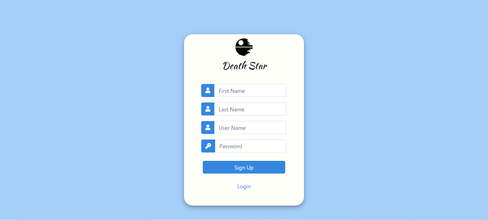
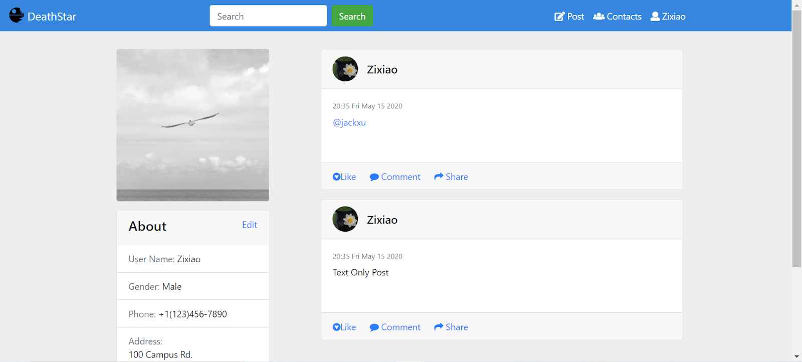
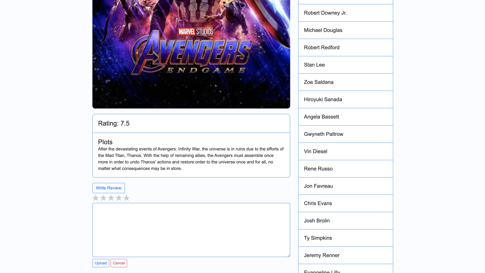

# DeathStarBench

Open-source benchmark suite for cloud microservices. DeathStarBench includes five end-to-end services, four for cloud systems, and one for cloud-edge systems running on drone swarms. 

## End-to-end Services 

* Social Network (released)
* Media Service (released)
* Hotel Reservation (released)
* E-commerce site (in progress)
* Banking System (in progress)
* Drone coordination system (in progress)

# Social Network Microservices

A social network with unidirectional follow relationships, implemented with loosely-coupled microservices, communicating with each other via Thrift RPCs. 

## Application Structure


Supported actions: 
* Create text post (optional media: image, video, shortened URL, user tag)
* Read post
* Read entire user timeline
* Receive recommendations on which users to follow
* Search database for user or post
* Register/Login using user credentials
* Follow/Unfollow user

## Pre-requirements
- Docker
- Docker-compose
- Python 3.5+ (with asyncio and aiohttp)
- libssl-dev (apt-get install libssl-dev)
- libz-dev (apt-get install libz-dev)
- luarocks (apt-get install luarocks)
- luasocket (luarocks install luasocket)

## Running the social network application
### Before you start
- Install Docker and Docker Compose.
- Make sure the following ports are available: port `8080` for Nginx frontend, `8081` for media frontend and 
  `16686` for Jaeger.

### Start docker containers
Start docker containers by running `docker-compose up -d`. All images will be 
pulled from Docker Hub.

### Register users and construct social graphs
Register users and construct social graph by running 
`python3 scripts/init_social_graph.py`. This will initialize a social graph 
based on [Reed98 Facebook Networks](http://networkrepository.com/socfb-Reed98.php),
with 962 users and 18.8K social graph edges.

### Running HTTP workload generator
#### Make
```bash
cd wrk2
make
```

#### Compose posts
```bash
cd wrk2
./wrk -D exp -t <num-threads> -c <num-conns> -d <duration> -L -s ./scripts/social-network/compose-post.lua http://localhost:8080/wrk2-api/post/compose -R <reqs-per-sec>
```

#### Read home timelines
```bash
cd wrk2
./wrk -D exp -t <num-threads> -c <num-conns> -d <duration> -L -s ./scripts/social-network/read-home-timeline.lua http://localhost:8080/wrk2-api/home-timeline/read -R <reqs-per-sec>
```

#### Read user timelines
```bash
cd wrk2
./wrk -D exp -t <num-threads> -c <num-conns> -d <duration> -L -s ./scripts/social-network/read-user-timeline.lua http://localhost:8080/wrk2-api/user-timeline/read -R <reqs-per-sec>
```

#### View Jaeger traces
View Jaeger traces by accessing `http://localhost:16686`

Example of a Jaeger trace for a compose post request: 


#### Use Front End
After starting all containers using `docker-compose up -d`, visit `http://localhost:8080` to use the front end.

First you could see the login and signup page:



In order to load default users into database, visit `http://localhost:8080/main.html` once. Then click compose to post new contents.

After composing a few posts, you could see your own posts in user timeline page. Click follow button on the right side to follow defualt users:


To see your own posts in home timeline page, click the username and profile button:


Posts could be mixed with text, user mention and image.

Click the contact button to follow/unfollow other users; follower/followee list would be shown below in form of user-id:


### Development Status

This application is still actively being developed, so keep an eye on the repo to stay up-to-date with recent changes. 

#### Planned updates

* Upgraded recommender
* Upgraded search engine 

### Questions and contact

You are welcome to submit a pull request if you find a bug or have extended the application in an interesting way. For any questions please contact us at: <microservices-bench-L@list.cornell.edu>


# Media Microservices

## Front-end
All front-end files are under `nginx-web-server/pages`

### Front-end Results
#### Home Page


#### Movie Detail Page




### Front-end Dependencies
- [jQuery](https://jquery.com/)
- [Bootstrap](https://getbootstrap.com/)

### Structures (HTML)
#### Home Page (index.html)
- header
  - naviagation bar
- main
  - page title
  - movie list
  - next & prev button

#### Movie Detail Page (movie.html)
- header
  - naviagation bar
- main
  - movie title
  - movie information section
    - left side
      - poster
      - rating
      - plot
      - review submit form
      - review list
    - right side
      - cast list

### Styles (CSS)
- implemented by [Bootstrap Grid System](https://getbootstrap.com/docs/4.4/layout/grid/)
  - movie grids on home page
  - layout on movie detail page
- custom styles in `styles/styles.css`

### Scripts (JS)
#### javascript/home.js
`getMovieList()`
- fetch information of all movies from the dataset file `movies.json`
- pass the returned data to `renderData(data)` in callback
- **Note that a backend service should be provided to fetch data of all movies stored in the Database instead of directly fetching data from the original dataset in the final version**

`getPageNum(maxPage)`
- get the current page from the query string params in URL. For example, if the URL is "index.html?page=10", then return page number 10
- if page number is not specified, page number is 1 by default
- also check the validation of the page number in URL, if not a valid integer between 1 and `maxPage`, then redirect to `index.html`

`generateMovieItem(title, id, poster)`
- generate HTML codes of an item in the movie grids with the parameters `title, id, poster`
- append the HTML codes in movie list container on the home page

`buttonHandler(pageNum, maxPage)`
- add click event handlers for next and prev button
- redirect to the next or previous page when next or prev button clicked
- Note that if `pageNum == 1`, then hide the prev button; and if `pageNum == maxPage`, then hide the next button

`renderData(movies)`
- render the movies data to display movies in girds
- calculate the total number of movies, and maximum page number
- set the number of movies shown on one page, `showNum = 9`
- determine the range of indexes of shown movies, then call `generateMovieItem(title, id, poster)` for each movie

#### javascript/movie.js
`getMovieId()`
- get movie ID from query string params in URL. For example, if the URL is "movie.html?movie_id=123456", then return 123456 as `movie_id`

`sendMovieId(movieId)`
- send a HTTP GET request to Lua API `wrk2-api/movie-info/read` with parameter `movieId`
- pass the returned data to `renderData(data)`

`generateStars(num)`
- generate the HTML codes of `num` stars, and return the HTML codes

`generateReviewList(reviewList)`
- generate HTML codes of the review list with the parameter `reviewList`
- append the HTML codes to review list container

`generateCastList(castList)`
- generate HTML codes of the review list with the parameter `castList`
- append the HTML codes to cast list container

`generateImage(imagePath, title)`
- generate HTML codes of the movie poster with parameters `imagePath, title`
- append the HTML codes to movie image container

`getRating(reviewList)`
- calculate average rating from reviews, and return the result

`renderData(data)`
- render data to display movie information on the movie detail page

#### javascript/upload_review.js
`uploadReview(uploadRating)`
- send a HTTP POST request to the Lua API `wrk2-api/review/compose` with user's review

`starts.on("click", function(event){...})`
- add click event handler to generate star clicking animation

## Dependencies
- thrift C++ library
- mongo-c-driver
- libmemcached
- nlohmann/json https://nlohmann.github.io/json/

## Pre-requirements
- Docker
- Docker-compose
- Python 3.5+ (with asyncio and aiohttp)
- libssl-dev (apt-get install libssl-dev)
- libz-dev (apt-get install libz-dev)
- luarocks (apt-get install luarocks)
- luasocket (luarocks install luasocket)

## Running the media service application
### Before you start
- Install Docker and Docker Compose.
- Make sure the following ports are available: port `8080` for Nginx frontend and 
  `16686` for Jaeger.

### Start docker containers
Start docker containers by running `docker-compose up -d`. All images will be 
pulled from Docker Hub.

### Register users and movie information
```
python3 scripts/write_movie_info.py && scripts//register_users.sh
```

### Running HTTP workload generator
#### Make
```bash
cd wrk2
make
```

#### Compose reviews
```bash
cd wrk2
./wrk -D exp -t <num-threads> -c <num-conns> -d <duration> -L -s ./scripts/media-microservices/compose-review.lua http://localhost:8080/wrk2-api/review/compose -R <reqs-per-sec>
```

#### View Jaeger traces
View Jaeger traces by accessing `http://localhost:16686`

## License & Copyright 

DeathStarBench is free software; you can redistribute it and/or modify it under the terms of the GNU General Public License as published by the Free Software Foundation, version 2.

DeathStarBench is being developed by the [SAIL group](http://sail.ece.cornell.edu/) at Cornell University. 

## Publications

More details on the applications and a characterization of their behavior can be found at ["An Open-Source Benchmark Suite for Microservices and Their Hardware-Software Implications for Cloud and Edge Systems"](http://www.csl.cornell.edu/~delimitrou/papers/2019.asplos.microservices.pdf), Y. Gan et al., ASPLOS 2019. 

If you use this benchmark suite in your work, we ask that you please cite the paper above. 


## Beta-testing

If you are interested in joining the beta-testing group for DeathStarBench, send us an email at: <microservices-bench-L@list.cornell.edu>
